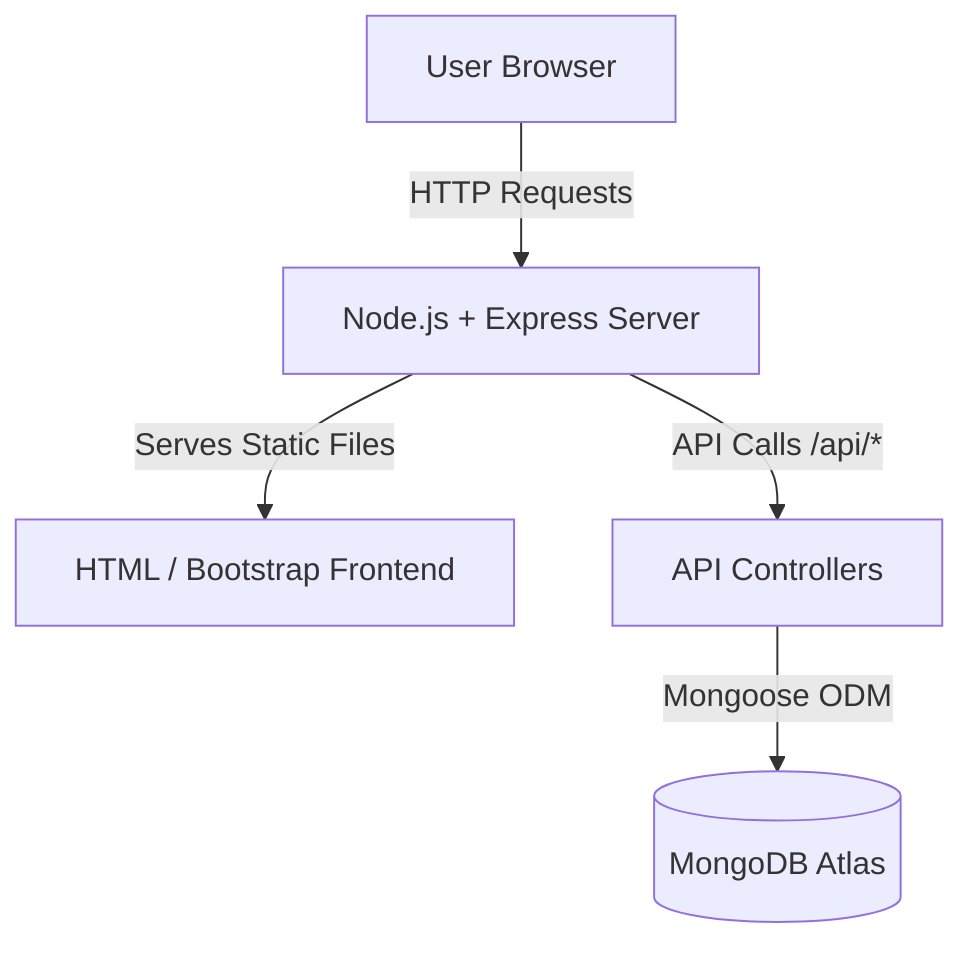

# ME-API Portfolio Project

A comprehensive full-stack portfolio application built with the **MERN** stack (MongoDB, Express, React/Vanilla JS, Node.js). This project demonstrates a robust backend serving a dynamic, responsive frontend.

🔗 **[Live Demo](https://my-portfolio1-spk6.onrender.com)   ** |
📄 **[Resume](https://docs.google.com/document/d/1RTuR8vxJrJK-9L6Lqv2rL2AX9ir0cMYjANhdr9pJtCQ/edit?usp=sharing)**

## 🏗️ Architecture

The application follows a **Monolithic Architecture** where the backend API and the frontend static files are served from the same Express.js server.



### Key Components:
- **Frontend**: Lightweight HTML5/CSS3 interface using **Bootstrap 5** for responsiveness and vanilla JavaScript for dynamic data fetching.
- **Backend API**: RESTful API built with **Express.js** to handle profile data operations.
- **Database**: **MongoDB** (via Mongoose) for flexible schema storage.

---

## 🚀 Setup Guide

### Prerequisites
- Node.js (v14+)
- MongoDB (Running locally or Atlas URI)

### 1. Local Development

1.  **Clone the repository**:
    ```bash
    git clone https://github.com/Sumitchahar317/Portfolio1.git
    cd Portfolio1
    ```

2.  **Install Dependencies**:
    ```bash
    npm install
    ```

3.  **Configure Environment**:
    Create a `.env` file in the root directory:
    ```env
    PORT=5001
    MONGO_URI=mongodb://127.0.0.1:27017/me-api
    ```

4.  **Seed the Database**:
    This populates the database with initial profile data.
    ```bash
    npm run seed
    # OR
    node backend/seed.js
    ```

5.  **Run the Server**:
    ```bash
    npm start
    # Server running on http://localhost:5001
    ```

### 2. Production Deployment (Render)

1.  **Push to GitHub**: Ensure your code is up-to-date on GitHub.
2.  **Creating Web Service**: Connect your repo to Render.
3.  **Build Command**: `npm install`
4.  **Start Command**: `node backend/server.js`
5.  **Environment Variables**: Add `MONGO_URI` (your MongoDB Atlas connection string).
6.  **Seeding Production DB**: run the seed script locally pointing to your prod DB:
    ```bash
    MONGO_URI="your_production_mongo_uri" node backend/seed.js
    ```

---

## 🗄️ Database Schema (Profile)

The core data model is the `Profile`, designed to hold portfolio information.

**Collection**: `profiles`

| Field | Type | Description |
| :--- | :--- | :--- |
| `name` | String | (Required) Full Name |
| `email` | String | (Required) Contact Email |
| `about` | String | Bio / Introduction text |
| `skills` | [String] | Array of technical skills |
| `education` | [Object] | List of educational background |
| `projects` | [Object] | Portfolio projects with links |
| `social` | Object | Links to LinkedIn, GitHub, etc. |

**Project Object Structure:**
```json
{
  "title": "Project Name",
  "description": "Brief description...",
  "technologies": ["React", "Node.js"],
  "codeLink": "https://github.com/...",
  "liveLink": "https://..."
}
```

---

## 📡 API Endpoints & Sample Requests

All API routes are prefixed with `/api`.

### 1. Get Profile
Fetch the portfolio data.

- **URL**: `/api/profile`
- **Method**: `GET`
- **CURL Example**:
  ```bash
  curl -X GET http://localhost:5001/api/profile
  ```

### 2. Create Profile
Initialize a new profile (Only works if DB is empty).

- **URL**: `/api/profile`
- **Method**: `POST`
- **Body**: JSON object matching schema.
- **CURL Example**:
  ```bash
  curl -X POST http://localhost:5001/api/profile \
  -H "Content-Type: application/json" \
  -d '{
    "name": "Jane Doe",
    "email": "jane@example.com",
    "about": "Full Stack Dev",
    "skills": ["Python", "Django"]
  }'
  ```

### 3. Filter Projects
Search projects by skill/technology.

- **URL**: `/api/projects?skill=React`
- **Method**: `GET`
- **CURL Example**:
  ```bash
  curl -X GET "http://localhost:5001/api/projects?skill=Node.js"
  ```

### 4. Health Check
Check if the server is running.

- **URL**: `/health`
- **Method**: `GET`

---

## ⚠️ Known Limitations

1.  **Single User Design**: The application logic in `profileController.js` currently enforces a single-profile policy (ideal for personal portfolios). To support multiple users, auth logic would need to be added.
2.  **No Authentication**: Currently, the `POST` and `PUT` endpoints are open publically. In a real-world scenario, you would add JWT authentication or an admin login to protect these routes.
3.  **Frontend-Backend Coupling**: The frontend is served statically by the backend. While simple for deployment, scaling might require separating the frontend into a standalone React/Vue app served via CDN.

